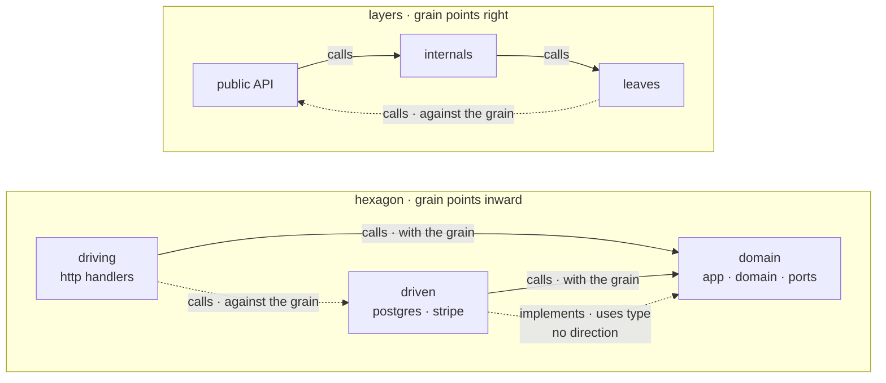

# ADR 0025 · Direction: only call-family links carry it, with the grain of the column rule

- Date: 2026-10-03
- Status: accepted
- Source: arch-fixtures FINDINGS.md F-5 (tau-rs/arch-design#10); amends spec §5 "direction fixed" and MAP-17 / MAP-26

## In plain words

The map draws code in columns and paints a link "the wrong way" as a smell. Under the hexagon rule the columns read driving → domain → driven, and the finding from fixtures is that every real hexagon repo would be covered in smells: a database adapter sits in the *driven* column and must mention domain types (it implements a domain port, it returns `Order`), and in practice it also calls domain code to build those values (`OrderStatus::parse`, `Money::new`). All of that is right → left by column, and all of it is correct hexagonal design. The rule as written confused *where control flows* with *who depends on whom*. This ADR fixes it in two moves: only links that mean "runs code over there" carry a direction at all, and each column rule says which way is "with the grain". For layers the grain is left → right as before. For hexagon the grain points inward, toward the domain, which is exactly the dependency-inversion arrow of the pattern. One analogy: the columns are lanes on a road, and the smell is driving against the traffic in your own lane, not changing lanes.

## Context

- Spec §5: "Two column rules … 'Uses' points left → right in both; a right-to-left link is drawn as a smell (MAP-26, direction fixed)". MAP-17 (flows/map-focus.html): "right-to-left links drawn dashed as a smell". MAP-26: "two column rules, hexagon (entry) and layers (no entry), chosen per unit, overridable".
- The fact model has 21 link kinds in four families (handoff-arch.md; tau-rs/arch#10): resolved `calls · calls port · depends on port · implements · refines · inherits · uses type · holds · reads · matches on · tests · re-exports · expands · decorates · constructs`, guessed `hands off · listens to · calls out · wires`, plus `refers-to`, `routes`, `queues`.
- Evidence (smallsvc, `repos/smallsvc/src/adapters/`): the postgres adapter has `impl OrderRepository for PgOrderRepository` (implements, driven → domain), `fn get(..) -> Result<Order, _>` (uses type), and calls `OrderStatus::parse`, `Money::new`, `status.as_str()`, `currency.code()`; the carrier and stripe adapters call `carrier.code()` and `amount.currency.code()`. Under "every link, left → right" all of these smell. Under "only calls, left → right" the five calls still smell.
- The fixtures harness (`checks/invariants.rs::direction_left_to_right`) today takes every resolved link and asserts a right → left link carries a `direction` finding; it waits on this ADR to narrow.

## Decision

1. **Only call-family links carry a direction.** The call family is `calls · calls out · hands off · listens to · routes` (route → handler). Every other kind, in particular `implements`, `refines`, `inherits`, `uses type`, `holds`, `constructs`, `reads`, `matches on`, `tests`, `re-exports`, `expands`, `decorates`, `refers-to`, `queues`, is drawn but never as a direction smell. `wires` (composition-root wiring) and `calls port` / `depends on port` are exempt too: the first is structure, the other two end on a rail.
2. **Direction exists only between two items that both have a column.** A link with an endpoint on a rail (a port, an external) is governed by MAP-31/32, not MAP-17. An item outside every area (the crate root `main.rs` / `lib.rs`, the Unplaced tray) has no column and no direction. Links inside one column (domain → ports when both are on the domain side) have no direction.
3. **Each column rule defines its grain.**
   - **layers**: columns ordered by dependency depth, public API left, leaves right. With the grain = to the same or a right-hand column. Against = to a left-hand column (the cycle smell).
   - **hexagon**: columns driving · domain · driven. With the grain = toward the domain: driving → domain, driven → domain. Against = domain → driving, domain → driven, driving → driven, driven → driving.
4. **MAP-17 reads**: a call-family link against the grain of the unit's column rule is drawn dashed as a smell. **Spec §5's "left → right in both" is amended** to "with the grain in both: left → right in layers, inward in hexagon". MAP-26 (rule chosen from the presence of an entry, overridable) is unchanged.
5. **Rejected: (c) "hexagon reads 'uses' as flow, not dependency".** Control flow through a trait object (domain → port → whichever adapter is wired) is not a fact rust-analyzer resolves; it is exactly what MAP-16 folds as an unresolved path. A drawing rule may not depend on a fact the analyzer cannot produce.

Before and after on smallsvc (hexagon):

| link | kind | before (every link, left → right) | after (ADR 0025) |
|---|---|---|---|
| `PgOrderRepository` → `OrderRepository` | implements | smell | drawn, no direction |
| `PgOrderRepository::get` → `Order` | uses type | smell | drawn, no direction |
| `to_order` → `OrderStatus::parse` | calls, driven → domain | smell | with the grain |
| `handlers::place` → `app::place` | calls, driving → domain | ok | with the grain |
| `handlers::x` → `PgOrderRepository::new` (hypothetical) | calls, driving → driven | ok | **smell** (bypasses the port) |
| `main` → `PgOrderRepository::new` | constructs / wires, no column | ok | no direction |

## Consequences

- The fixtures harness narrows `direction_left_to_right` to call-family links between columned items and reads the grain from `rule`; smallsvc yields zero direction smells, and a handler calling an adapter directly yields one. The check keeps citing MAP-17/26 (arch-fixtures #5).
- `arch-views` computes the smell set per rule; the `direction` lint (F-2, tau-rs/arch#13) is the finding form of the same set and follows ADR 0009 (guessed warns, declared never gates).
- sett's map stories need both grains: "layers direction (public API left)" stays (spec §12); hexagon stories show inward.
- One honest consequence: the direction rule cannot tell a driven adapter that *maps* domain values from one that *runs domain logic*; both are driven → domain calls and both are with the grain. Catching the second is a lint's job, not a drawing rule's.
- A second honest consequence: links to rails have no direction at all, so "domain calls an external directly" is not a direction smell either; it is the `arch init` template rule "externals only from driven" (ADR 0006), which fires as a finding.
