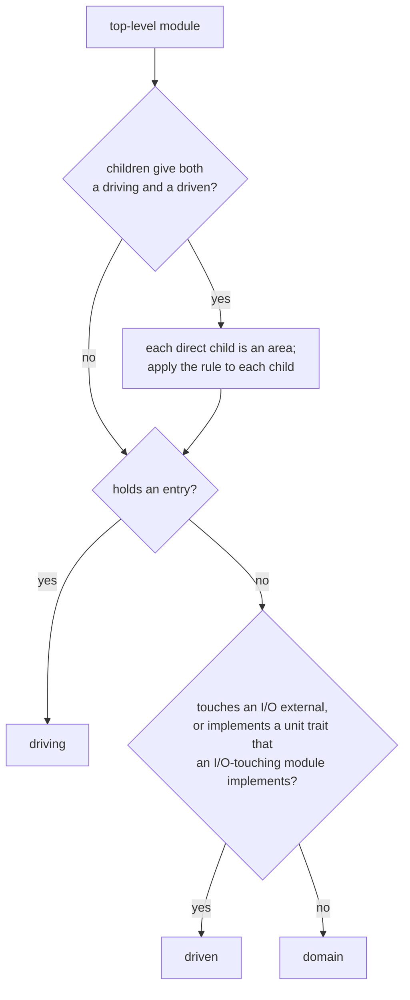

# ADR 0027 · `arch init` sides: entry → driving, I/O external → driven, otherwise domain

- Date: 2026-10-03
- Status: accepted
- Source: arch-fixtures FINDINGS.md F-6 (tau-rs/arch-design#6); amends [ADR 0006](0006-arch-init.md) "computed sides" and spec §13.6
- Settled since: tau-rs/arch-design#7 is decided by [ADR 0028](0028-entry-kinds-spawned-worker.md): the worker spawned at start-up is an entry, so `issue_delivery_worker` and smallsvc `src/worker.rs` are **driving**; the "if #7" rows below read that way

## In plain words

`arch init` is the one command that makes a repo usable on day one: it writes `.arch/areas.toml`, the file that says which part of the code sits in which column of the map. In a hexagon the columns are the three *sides*: **driving** (what starts the work: HTTP handlers, workers), **domain** (the business logic) and **driven** (what the logic uses to reach the outside: database, HTTP clients). ADR 0006 says the sides are "computed" and never says how. Fixtures found the gap on zero2prod, a real service that is not laid out as a hexagon: three of its modules run SQL directly and are neither routes nor adapters, so nothing says where they go. This ADR states the rule: look at each top-level module and ask three questions in order. Does it hold an entry (a place where the outside world starts the code)? Then driving. Does it talk to the outside world itself? Then driven. Neither? Then domain. One analogy: a restaurant; whoever takes orders at the door is driving, whoever goes out to the suppliers is driven, and the kitchen is whoever does neither. Three small additions are needed so that the rule holds on real repos and so that smallsvc, the fixture built as a textbook hexagon, comes out with the sides it already declares: a module that mixes order-takers and suppliers (`adapters/`) is split one level, an in-memory stand-in for a supplier counts as a supplier, and test code is ignored (a mock does not move the module it lives in). The override in `areas.toml` stays the escape hatch. Where things stand: the rule reproduces every side in smallsvc's file and answers the three zero2prod modules; the side of a background worker follows whatever tau-rs/arch-design#7 decides an entry is.

## Context

- [ADR 0006](0006-arch-init.md): `arch init` writes "`areas.toml` with computed sides and order", no rule stated. [ADR 0004](0004-areas-derived-no-source-annotation.md): areas derive from the module tree; `areas.toml` holds overrides. MAP-26: a unit with an entry uses the hexagon column rule, a unit without one uses layers.
- Fixtures F-6: zero2prod's `authentication`, `idempotency` and `issue_delivery_worker` do SQL directly and are neither routes nor adapters.
- The fact model already produces what a rule needs (spec §9): entries, `route → handler`, externals with their port kind (rpc · http · cli · topic · crate · sql · pub · redis · fs · tty, MAP-31), `implements`.
- Two things the plain three-line rule gets wrong on smallsvc (`repos/smallsvc/` in arch-fixtures):
  - `adapters` is **one** top-level module holding both the HTTP handlers (entry) and the postgres/stripe/carrier/email adapters (externals). First match wins would put all of it in driving.
  - `adapters::memory` implements `OrderRepository` and `Outbox` in a `HashMap`. It touches no external, so it would land in domain, next to the ports it implements.

## Decision

Sides exist only in a hexagon unit (MAP-26). In a layers unit `arch init` writes order only.

1. **Grain.** The rule is applied to each top-level module of the unit's root crate (`src/x.rs` or `src/x/`). The crate root (`main.rs`, `lib.rs`) has no side ([ADR 0025](0025-direction-call-family-grain.md), decision 2).
2. **The rule, first match wins.**
   1. The module **holds an entry** → **driving**.
   2. The module **touches an I/O external**, or **implements a trait of the unit that a module touching an I/O external also implements** → **driven**.
   3. Otherwise → **domain**.
3. **Definitions.**
   - *Non-test code only*: the rule reads facts from non-test code. Items under `#[cfg(test)]` and test targets are ignored. Why: an inline `mod tests` with a fake repository, or a `mockall` mock generated next to the trait, would otherwise pull `app` or `ports` into driven; a domain test that opens a database would do the same.
   - *Holds an entry*: the module defines a function the fact model lists as an entry, or the handler end of a `route → handler` link. A middleware is not an entry. This ADR does not define entry kinds; it reads whatever the fact model lists (spec §9, and tau-rs/arch-design#7 when decided).
   - *I/O external*: an external whose port kind is rpc · http · cli · topic · sql · redis · fs · tty. Kinds `crate` and `pub` do not count. Why: every module uses some library; counting libraries would make everything driven.
   - *Implements a trait … also implements*: the trait is declared in the unit (not `std`, not a dependency). Why: an in-memory repository is a stand-in for the real one and must sit in the same column; "same port, same side" is the cheapest fact that says so.
4. **Split, one level, only on a driving/driven mix.** If applying the rule to a top-level module's direct children gives at least one driving child **and** at least one driven child, the module is not one area: each direct child becomes an area with its own side from the rule. The area takes the child's bare name (`http`, `postgres`); when two areas would share a name it is prefixed with its parent (`orders::handlers`, `users::handlers`). Otherwise the module is one area and takes its side from the rule applied to the whole module. The split never goes deeper than one level. Why only on that mix: a module whose children are "driven and domain" (zero2prod's `authentication`: `password` runs SQL, `middleware` does not) is one thing to its author and stays one area.
5. **Override.** `arch init` writes the computed side of every area into `areas.toml`; a person who disagrees edits the file ([ADR 0004](0004-areas-derived-no-source-annotation.md)). Nothing is asked ([ADR 0006](0006-arch-init.md)).
6. **Not decided here: order.** ADR 0006 also says "computed order"; that rule is still unstated (filed separately, see consequences). Since stated by [ADR 0029](0029-arch-init-order-rule.md).

### Result on zero2prod (F-6)

| module | entry | I/O external | side |
|---|---|---|---|
| `authentication` | no (`reject_anonymous_users` is a middleware) | sql (`password`) | **driven** |
| `idempotency` | no | sql (`persistence`) | **driven** |
| `issue_delivery_worker` | only if #7 makes the `main`-spawned loop an entry | sql, and http through `email_client` | **driving** if #7 is accepted as filed; **driven** otherwise |

The rest of zero2prod, for fixtures to confirm against the golden facts when it writes the expected `areas.toml`: `routes` → driving (handlers; no split, every child holds handlers), `startup` → driving (builds and runs the actix server), `email_client` → driven (http), `domain` → domain, `configuration` · `session_state` · `telemetry` · `utils` → domain unless the facts show an I/O external.

### Result on smallsvc

| area in `repos/smallsvc/.arch/areas.toml` | why | computed side | file says |
|---|---|---|---|
| `http` (`adapters::http`) | `adapters` split; holds the route handlers | driving | driving |
| `postgres` | split; sql | driven | driven |
| `memory` | split; implements `OrderRepository` and `Outbox`, which `postgres` implements | driven | driven |
| `stripe` · `carrier` · `email` | split; http (email also tty) | driven | driven |
| `app` (`src/app/**`) | no entry, no I/O external (`app::notify` naming `LogNotifier` is a dependency, already in `.arch/allows`) | domain | domain |
| `domain` · `ports` | neither | domain | domain |
| `src/config.rs` | reads the environment; not an external port kind | domain | domain (listed under `app`) |
| `src/worker.rs` | reaches the outbox only through `Services` | domain today; **driving** if #7 is accepted as filed | domain (listed under `app`) |

Every side in the file is reproduced. Two things in the file are not sides and are not produced by this rule: the grouping of `src/worker.rs` and `src/config.rs` (and `migrations/**`) under another area's `paths`, and the `order` values. Those are overrides in the sense of ADR 0004.

## Consequences

- `arch init` (tau-rs/arch) implements decisions 1–5; fixtures writes zero2prod's expected `areas.toml` from the table above (arch-fixtures #3).
- Spec §13.6 and ADR 0006 keep their text and gain a reference to this ADR; nothing is renumbered.
- One honest consequence: on a repo that is not a hexagon the rule still answers, and the template rules then fire on day one. zero2prod's `routes` run SQL themselves ("externals only from driven") and call `authentication` (driving → driven, against the grain of ADR 0025). That is the tool telling the truth about the repo, not a wrong side; it is also the first thing a new user sees.
- A second honest consequence: **domain is the catch-all.** `telemetry`, `utils`, `configuration` land there because they are neither of the other two, not because they are business logic. The override is the answer; a fourth "support" side is not in V1.
- A third honest consequence: the side of a worker follows #7, on purpose: the product has one meaning of "entry", and the sides rule has no private one. If the `main`-spawned loop becomes an entry, `issue_delivery_worker` and smallsvc's `worker` both become driving, smallsvc's `areas.toml` changes by one area (`src/worker.rs` leaves `app`), and zero2prod's worker gets the same day-one findings as its routes (SQL outside driven; a call to `email_client` against the grain). If it does not, `issue_delivery_worker` is driven, which reads wrong for the thing that starts the delivery work. Rejected: excluding `main`-spawned entries from clause 1 to keep smallsvc's file fixed.
- A fourth honest consequence: on a repo laid out by feature (`orders/{handlers,repo,model}`), the split gives three areas per feature. More areas, but the alternative is every feature in driving and two empty columns. Rejected: never splitting, which puts all of smallsvc's `adapters` in driving.
- The analyzer must mark test-only items so the rule can ignore them (tau-rs/arch#21). Rejected: leaving in-memory adapters to a hand override, which makes the reference hexagon need an edit straight after `init`.
- The sibling clause (decision 3) can misfire when a domain type implements a unit trait that an adapter also implements for a reason other than being a port. Rare; override.
- The split clause adds one case where an area is a second-level module in V1; V2's "modules as default sub-areas" (roadmap) generalises it.
- "Computed order" in ADR 0006 has no rule either; filed as its own issue rather than decided here.
