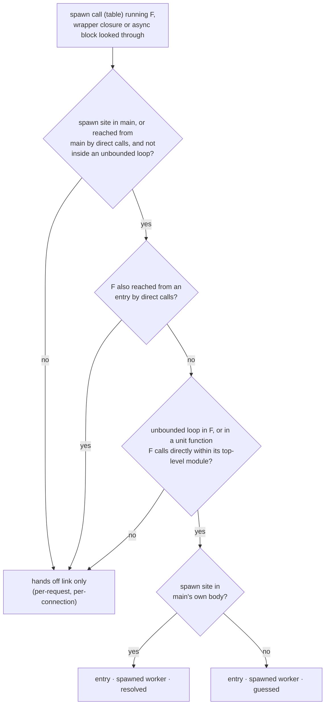

# ADR 0028 · Entry kinds: the worker spawned at start-up is an entry

- Date: 2026-10-03
- Status: accepted
- Source: arch-fixtures FINDINGS.md F-11 (tau-rs/arch-design#7); amends spec §7 "entries including framework-held ones"; settles the open rows of [ADR 0027](0027-arch-init-sides-rule.md)

## In plain words

An *entry* is a place where the outside world starts the code: `main`, an HTTP handler, a queue consumer. arch needs the list of entries because everything hangs off it: the flows it draws start there, and since ADR 0027 the *side* of a module (driving, domain, driven: the three columns of a hexagon map) is read from whether the module holds one. Today the spec knows two ways to find an entry besides `main`: a table of frameworks (axum, actix, …) and a generic rule for callbacks. Neither sees the most common background job there is: `main` starts a loop on the side with `tokio::spawn` and that loop polls a table forever. Both service fixtures have one (smallsvc's outbox worker, zero2prod's newsletter delivery worker), and today the analyzer shows them as a dashed "hands off" link from `main` and no entry, so smallsvc's notify flow starts nowhere. One analogy: a restaurant has a front door and a delivery hatch at the back; the hatch is not on the list of doors because nobody rings there, the kitchen opened it itself in the morning, yet work comes in through it all day. This ADR adds that hatch as a third entry kind, the **spawned worker**: a function started once at start-up through a spawn call, which then loops for the life of the process. Checking the wording filed in #7 against real code changed it in two places: the loop is often one call below the spawned function (zero2prod's own worker, which the filed wording would have missed), and "awaits a shutdown signal" was dropped because it turns a three-line ctrl-c listener into an entry. Where things stand: with this rule both fixture workers are entries at full confidence, zero2prod's worker module is definitely driving, and smallsvc's `worker.rs` leaves the `app` area for a driving area of its own.

## Context

- Spec §7: "entries including framework-held ones (table: axum, actix, tonic, bevy App, lambda; generic rule: the entry calls into a dependency that calls back)". `Entry {item, framework?}` in the fact model (`handoffs/handoff-arch.md`). In a bin unit `main` is an entry.
- [ADR 0009](0009-confidence-levels.md): every fact is `resolved`, `guessed` or `declared`; a finding on a guessed fact warns, never blocks. `hands off` is one of the link kinds guessed from patterns; spawn paths are folded to a pill (MAP-16).
- [ADR 0027](0027-arch-init-sides-rule.md) reads entries from the fact model and left two rows conditional on this decision: zero2prod `issue_delivery_worker` and smallsvc `src/worker.rs`.
- The arch-analyze lane (tau-rs/arch#3) emits today, for smallsvc: a `hands off` link `main → run_outbox_worker` (guessed, reason `tokio::spawn`) and no entry.
- The definition filed in #7: "a function reachable from `main` only through `tokio::spawn` / `std::thread::spawn` (or an executor's equivalent) whose body loops or awaits a shutdown signal; `resolved` when the spawn is in `main`'s closure, `guessed` otherwise".

### The filed definition against real code

| case | code | filed definition | wanted |
|---|---|---|---|
| smallsvc worker | `src/main.rs:34` `tokio::spawn(run_outbox_worker(..))`; `src/worker.rs` body is `loop { tokio::select! { tick, shutdown } }` | entry | entry |
| zero2prod worker | `src/main.rs:16` `tokio::spawn(run_worker_until_stopped(configuration))`; the body builds a pool and a client, then calls `worker_loop`, and the `loop` is **there** | **missed**: the spawned function's own body has no loop and awaits no signal | entry |
| zero2prod server | `src/main.rs:15` `tokio::spawn(application.run_until_stopped())`; body is `self.server.await` | not an entry | not an entry: the actix table already lists the handlers |
| ctrl-c listener | `tokio::spawn(async move { tokio::signal::ctrl_c().await.ok(); let _ = tx.send(true); })` in `main` | **entry** ("awaits a shutdown signal") | not an entry |
| one-shot start-up task | `tokio::spawn(warm_cache(pool.clone()))` in `main` | not an entry | not an entry |
| per-connection task | mini-redis `src/server.rs:259`: `tokio::spawn` inside the accept `loop` (line 219); the handler body is `while !self.shutdown.is_shutdown() { … }` (line 321) | **entry** (reachable from `main` only through spawn, body loops) | not an entry: one per connection, started by the accept loop, which is `main`'s own flow |
| task spawned by a handler | `tokio::spawn(send_welcome_email(..))` in a route | unclear ("reachable from `main`"?) | not an entry: part of that handler's flow |
| worker started by a builder | `Application::build` (called by `main`) does `tokio::spawn(run_worker(..))` | entry, guessed | entry, guessed |
| worker pool | `for _ in 0..n { std::thread::spawn(move \|\| worker(rx.clone())) }` in `main` | entry | one entry (the function), not `n` |
| `spawn_blocking` | `spawn_blocking(move \|\| verify_password_hash(..))` in a handler | unclear | not an entry: finite work on a handler's flow |

Three gaps: "whose body" is too narrow (zero2prod), "awaits a shutdown signal" is too wide (the listener), and nothing separates a task started once at start-up from one started per connection or per request.

## Decision

1. **A third entry kind: `spawned worker`.** Spec §7's entry list reads: `main`; framework-held (the table and the generic rule, unchanged); **spawned workers** (this ADR).
2. **Definition.** A function `F` of the unit is a spawned worker when all four hold:
   1. **Spawned.** `F` is what a spawn call runs. The spawn calls are a table, like the framework table: `tokio::spawn` · `tokio::task::spawn_local` · `tokio::task::spawn_blocking` · `Runtime::spawn` / `Handle::spawn` · `JoinSet::spawn` · `std::thread::spawn` · `std::thread::Builder::spawn` · `async_std::task::spawn` · `smol::spawn`. The argument is the call `F(..)` itself, or a closure or `async` block whose body is that one call (`async move { run(cfg).await }`, `move || run(rx)`); the wrapper is looked through.
   2. **At start-up.** The spawn site is in `main`, or in a function reachable from `main` by direct calls, and is **not inside an unbounded loop**. Why: a spawn in a handler or inside an accept loop starts one task per request or per connection; that task belongs to the flow that started it.
   3. **Only through spawn.** No path of direct calls leads from an entry to `F`. Why: if `main` also calls `F(..).await` directly, `F` is ordinary code on `main`'s flow.
   4. **Runs for the life of the process.** An unbounded loop is in `F`'s body, or in the body of a unit function that `F` reaches by direct calls **without leaving `F`'s top-level module**. Why the module limit: a set-up function that delegates to its loop lives next to it (zero2prod); a `while` in a far-away helper says nothing about `F`.
3. **Unbounded loop.** `loop`, `while` and `while let` are unbounded, whatever their exit (`break`, `return`, a shutdown flag). `for` is bounded, except over a channel receiver or a listener (`std::sync::mpsc::Receiver` and its iterators, `crossbeam_channel::Receiver` and its iterators, `std::net::Incoming`), which needs the type-checked view; under degrade ([ADR 0010](0010-degrade.md)) a `for` is bounded.
4. **"Awaits a shutdown signal" is not part of the definition.** A real worker that stops on a signal does so inside its loop (smallsvc); the clause alone only adds the ctrl-c listener.
5. **One entry per function.** `F` spawned from three sites or `n` times in a `for` is one entry; the first spawn site in source order is its witness.
6. **Confidence** ([ADR 0009](0009-confidence-levels.md)): **`resolved`** when the spawn site is in `main`'s own body; **`guessed`** when it is in a function `main` reaches by direct calls, or when the crate is degraded. Why: in `main` the spawn runs once per process by construction; one call away, a builder may run it conditionally, per tenant or per test, and arch does not know.
7. **No double listing.** A function the framework table already lists is not listed again. A spawned function that only awaits a framework's server (`self.server.await`, `axum::serve(..).await`) has no unbounded loop in the unit and is not a spawned worker; the framework's handlers are the entries.
8. **A block is not an entry.** `tokio::spawn(async move { loop { … } })` written inline has no function to name (`Entry {item}` needs an item). No entry is added; the work stays on the enclosing function's flow, behind its `hands off` link. In `main` that is already an entry's flow.
9. **The `hands off` link stays.** The link `main → F` (guessed, reason: the spawn call) is still emitted; the entry is one added fact, not a replacement. The entry names its kind and its spawn site; the field shape is `arch-facts`' (tau-rs/arch owns the facts schema).
10. **Non-test code only**, as in ADR 0027: a spawn site under `#[cfg(test)]` or in a test target adds no entry.



### Result on the two fixtures

| repo | function | spawn site | loop | result |
|---|---|---|---|---|
| smallsvc | `worker::run_outbox_worker` | `src/main.rs:34`, in `main` | own body (`loop` + `select!`) | **entry, resolved** |
| zero2prod | `issue_delivery_worker::run_worker_until_stopped` | `src/main.rs:16`, in `main` | `worker_loop`, same module, called directly | **entry, resolved** |
| zero2prod | `startup::Application::run_until_stopped` | `src/main.rs:15`, in `main` | none (`self.server.await`) | not a spawned worker; `hands off` link only |

smallsvc then has the entries fixtures expects (`main`, the axum handlers, the worker) and its notify flow starts at `run_outbox_worker`. The first smallsvc golden gains one entry fact (tau-rs/arch#3): one reviewed golden bump.

### Knock-on to ADR 0027's tables

| row in ADR 0027 | was | now |
|---|---|---|
| zero2prod `issue_delivery_worker` | "driving if #7 is accepted as filed; driven otherwise" | **driving**, definite (clause 1, holds an entry) |
| smallsvc `src/worker.rs` | "domain today; driving if #7 is accepted as filed"; listed under `app` | **driving**, as its own area `worker` (a top-level module, ADR 0027 decision 1) |

smallsvc's `areas.toml` changes by one area; the file as it stands no longer matches the computed sides until fixtures moves the path (arch-fixtures #3):

```toml
[[area]]
name = "app"
side = "domain"
paths = ["src/app/**", "src/config.rs"]        # src/worker.rs removed
order = 1

[[area]]
name = "worker"
side = "driving"
paths = ["src/worker.rs"]
order = 2                                       # after http; the order rule itself is #24
```

Every other row of both tables is unchanged. ADR 0027's sentence "every side in the file is reproduced" holds again once that edit lands.

## Consequences

- Spec §7 gains the third kind by reference to this ADR; ADR 0027 gains a pointer; nothing is renumbered. `arch-analyze` (tau-rs/arch#3) implements decisions 1–10 and keeps the `hands off` link.
- MAP-26 is unchanged: in a bin unit `main` is already an entry, so this kind adds entries and never changes the column rule by itself.
- One honest consequence: **the definition is not the one filed in #7.** It is wider in one place (the loop may be one direct call away, inside the module) and narrower in two ("awaits a shutdown signal" is gone; the spawn must be on the start-up path and outside an unbounded loop). The filed wording missed zero2prod's worker, the very case it was filed for.
- A second honest consequence: **smallsvc's worker becomes driving and is clean; zero2prod's is not.** `run_outbox_worker` only calls `services.notify.drain` (driving → domain, with the grain). zero2prod's worker runs SQL itself ("externals only from driven") and calls `email_client` and `startup::get_connection_pool`, so it gets the same day-one findings as its routes, as ADR 0027 said it would.
- A third honest consequence: **`while` is counted as unbounded without looking at its condition.** A one-shot start-up task whose module has a `while i < n` on its direct-call path becomes a worker entry. Rare (three other conditions must hold), wrong when it happens, and at `resolved` if spawned in `main`. Rejected: reading loop conditions, which is a termination proof arch cannot give.
- A fourth honest consequence: **an inline `async move { loop { … } }` in `main` gives no entry.** Its work shows as part of `main`'s flow. Extracting the block into a function makes it one. Rejected: an entry without an item, which changes the fact model for a case the user fixes in one refactor.
- A fifth honest consequence: **a guessed entry still sets a side.** ADR 0027 reads entries whatever their confidence, so a module whose only entry is a worker spawned by a builder comes out driving on a guess; findings that depend on it follow ADR 0009 (warn, never block) and the override in `areas.toml` is the answer.
- Not covered, on purpose: a supervisor (a spawned function that spawns the loops itself, having no loop of its own), a worker started only from another worker, and executors outside the table. Each shows as a `hands off` link and no entry; the table grows by ADR when a fixture needs it.
- The framework table has fixtures only for axum and actix (arch-fixtures #8); the spawn table has fixtures for `tokio::spawn` only. A `std::thread::spawn` worker fixture belongs with that issue.
