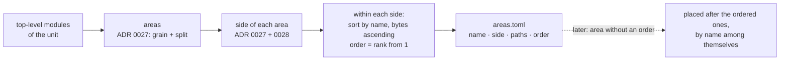

# ADR 0029 · `arch init` order: alphabetical by area name within a side; one area per top-level module, grouping is a hand override

- Date: 2026-10-03
- Status: proposed (draft: the choice between the candidates is with the product chat, see "The three candidates against real code")
- Source: tau-rs/arch-design#24 (from:fixtures, found while writing [ADR 0027](0027-arch-init-sides-rule.md)); amends [ADR 0006](0006-arch-init.md) "computed sides and order" and spec §13.6

## In plain words

`arch init` is the one command that makes a repo usable on day one: it writes `.arch/areas.toml`, the file that says which part of the code (an *area*, by default one top-level module) sits in which column of the map (its *side*: driving, domain or driven) and at which position inside that column (its *order*). ADR 0006 says both are "computed". ADR 0027 states how the side is computed; nothing states how the order is, so fixtures cannot check that `arch init` on smallsvc, the small reference service, gives back the file that is checked in. Three rules were on the table: sort by name, sort by the kind of outside system each area talks to, or put the most-called area first. Each was run against smallsvc and against zero2prod, a real service. Only sorting by name answers for every column, needs nothing but the names, and never moves an area because some other code changed; it is also the only one that gives back the order smallsvc already has in two of its three columns. One analogy: books on a shelf sorted by title; anyone can predict where a new book goes, and lending one out does not reshuffle the shelf, which sorting by "most borrowed" would do every week. This ADR therefore states: within a side, areas are ordered by name. It also states what `arch init` writes beyond sides and order: one area per top-level module, a single file included, and nothing else; putting `config.rs` inside `app` or `migrations/` inside `postgres` is always a person's edit. Where things stand: the rule gives smallsvc's driving and domain orders as they are and puts the new `worker` area second in driving, as ADR 0028 guessed; the five driven positions in smallsvc's file are a hand-made order (the order of the business flow) that no rule produces.

## Context

- [ADR 0006](0006-arch-init.md): `arch init` writes "`areas.toml` with computed sides and order", one commit, no questions. [ADR 0004](0004-areas-derived-no-source-annotation.md): areas derive from the module tree; `areas.toml` holds overrides. [ADR 0027](0027-arch-init-sides-rule.md): the sides rule, its grain (each top-level module, `src/x.rs` or `src/x/`), the one-level split, and "in a layers unit `arch init` writes order only". [ADR 0028](0028-entry-kinds-spawned-worker.md): smallsvc's `src/worker.rs` becomes a driving area `worker`, order guessed as 2.
- MAP-1, 3, 24 (`spec/map-invariants.md`): positions inside a unit come from facts only and are byte-identical between saves for unchanged items; a recompute touches only changed items.
- The rail (the unit's flat sides, which hold the ports to external systems) has a fixed section order: platform services · third-party · events · data stores · os · libraries · unresolved (spec §5, MAP-31).
- #24 first recommended the declaration order of the `mod` lines, then retracted it: rustfmt sorts `mod` lines, so declaration order is alphabetical in practice (true of both fixtures: `src/lib.rs` and `src/adapters/mod.rs` in smallsvc, `src/lib.rs` in zero2prod).
- smallsvc's file (`repos/smallsvc/.arch/areas.toml` in arch-fixtures) has driven order postgres 1 · memory 2 · stripe 3 · carrier 4 · email 5, and groups `src/config.rs` under `app` and `migrations/**` under `postgres`.

### The three candidates against real code

Sides are those of ADR 0027 and ADR 0028. zero2prod is read at the commit fixtures pins (`970987c`).

| candidate | smallsvc driving | smallsvc domain | smallsvc driven | zero2prod driven |
|---|---|---|---|---|
| the file today | `http` (+ `worker` 2, guessed) | `app` · `domain` · `ports` | `postgres` · `memory` · `stripe` · `carrier` · `email` | (no file yet) |
| **alphabetical** | `http` · `worker` | `app` · `config` · `domain` · `ports` | `carrier` · `email` · `memory` · `postgres` · `stripe` | `authentication` · `email_client` · `idempotency` |
| rail section order | no answer (no external) | no answer (no external) | `carrier` · `email` · `stripe` (third-party, tied) · `postgres` (data stores) · `memory` (no external, no answer) | `email_client` (third-party) · `authentication` · `idempotency` (data stores, tied) |
| most-called first | tied at 0 (nothing calls a handler or a worker) | `domain` · `ports` · `app` | `email` (1 resolved call, the allowed `app::notify → LogNotifier`), the other four tied at 0 | `authentication` and `email_client` close, `idempotency` last |

What the check shows:

- **Rail section order answers for one column only**, and inside it leaves ties (three third-party adapters) and a hole (`memory` touches nothing). It needs a second rule for driving, for domain, for layers units, and for every tie; that second rule can only be the name. It reproduces no line of smallsvc's driven order: the file puts the data store first, the rail puts data stores fourth. It also reads externals, which are guessed when a crate degrades ([ADR 0010](0010-degrade.md)), so the order could differ between a degraded run and a type-checked one.
- **Most-called first is empty where it matters.** In a hexagon the driven adapters are called through port traits (`Arc<dyn OrderRepository>`), so the resolved calls into them are zero, apart from the constructors in `main`, which has no side. Counting calls through the ports instead (smallsvc: `OrderRepository` 9 call sites, `Outbox` 6, the three others 1 each) ties `postgres` with `memory` and the last three with each other. And it is unstable by construction: one new call in one function can swap two areas whose own code did not change, which MAP-24 forbids.
- **Alphabetical is the only total rule.** It answers for every side and for layers units, has no ties (area names are unique, ADR 0027 decision 4), reads no fact beyond the names, and gives the same answer degraded or not. It reproduces smallsvc's driving order, its domain order (`app` · `domain` · `ports`, with `config` slotting in between once it is its own area), and the `worker = 2` of ADR 0028.
- **No candidate reproduces smallsvc's driven order.** postgres · memory · stripe · carrier · email is the order of the business flow (store the order, pay, ship, notify; the argument order of `Services::new`). That is a person's reading of the service, which is exactly what an override is for.

## Decision

1. **The order rule.** Within a side of a hexagon unit, and within a column of a layers unit, areas are ordered by **area name, ascending, compared byte by byte** (the UTF-8 bytes of the name; no locale, no case folding, no natural-number sorting). `order` is the 1-based rank in that sequence, dense, counted separately per side. Why bytes: the same input must give the same file on every machine, and a locale-aware or "natural" comparison is one more thing that can differ.
2. **The name compared is the area's name as `arch init` writes it**: the module's bare name, or the parent-prefixed name when ADR 0027 decision 4 prefixes it (`orders::handlers`). An area born from a split sorts under its own name, not its parent's (`http`, from `adapters`, sorts with `worker`).
3. **What `arch init` writes into `areas.toml`** ([ADR 0006](0006-arch-init.md), completed): `rule`, `main_bin`, and one `[[area]]` per area with exactly four keys: `name`, `side` (hexagon units only), `paths`, `order`. Areas are written side by side in column order, then by `order`.
4. **One area per top-level module, a single file included.** `src/x/` gives `paths = ["src/x/**"]`; `src/x.rs` gives `paths = ["src/x.rs"]`; a split child gives `paths = ["src/x/child/**"]` or `["src/x/child.rs"]`. `arch init` never writes a path pattern holding more than one module, and never a path outside the unit's Rust sources. Why: a single file is a module like any other to the rule of ADR 0027, and merging two modules is a judgement about meaning that `arch init`, which asks no questions, cannot make.
5. **Grouping is always a hand override.** Listing `src/config.rs` under `app`, or `migrations/**` under `postgres`, is a person's edit of `areas.toml` ([ADR 0004](0004-areas-derived-no-source-annotation.md)). `arch init` never produces either. A non-Rust path places no item ([ADR 0008](0008-non-rust-ignored.md)); it is allowed in the file and changes nothing on the map.
6. **After `init`, the file is the order.** An `order` in `areas.toml` is kept as written; `arch` never rewrites it. An area with no `order` in the file (a module added later, an area whose line a person deleted) is placed **after** every area of its side that has one, and such areas are ordered among themselves by rule 1. Why: inserting a new area at its alphabetical rank would have to guess where it falls among hand-ordered neighbours; appending moves nothing that was already there (MAP-1, 24).
7. **Override.** A person who wants another order edits the numbers, by hand or by dragging on the Map (one change to `areas.toml` on Keep, spec §5). Nothing is asked ([ADR 0006](0006-arch-init.md)).

### Result on smallsvc

What `arch init` writes, against the file as it stands after ADR 0028's edit:

| side | area | computed `paths` | computed `order` | file says | verdict |
|---|---|---|---|---|---|
| driving | `http` | `src/adapters/http/**` | 1 | same, 1 | reproduced |
| driving | `worker` | `src/worker.rs` | 2 | same, 2 (ADR 0028's guess) | reproduced |
| domain | `app` | `src/app/**` | 1 | `src/app/**`, `src/config.rs`; 1 | order reproduced; **`paths` is a hand override** (grouping) |
| domain | `config` | `src/config.rs` | 2 | no such area | absent because of the grouping override |
| domain | `domain` | `src/domain/**` | 3 | same paths; 2 | same relative order; the number differs only because `config` is grouped away |
| domain | `ports` | `src/ports/**` | 4 | same paths; 3 | same |
| driven | `carrier` | `src/adapters/carrier/**` | 1 | same paths; 4 | **`order` is a hand override** |
| driven | `email` | `src/adapters/email/**` | 2 | same paths; 5 | **`order` is a hand override** |
| driven | `memory` | `src/adapters/memory/**` | 3 | same paths; 2 | **`order` is a hand override** |
| driven | `postgres` | `src/adapters/postgres/**` | 4 | `src/adapters/postgres/**`, `migrations/**`; 1 | **`order` and `paths` are hand overrides** |
| driven | `stripe` | `src/adapters/stripe/**` | 5 | same paths; 3 | **`order` is a hand override** |

So the hand overrides in smallsvc's file are seven values: two `paths` (the grouping of `src/config.rs` under `app`, of `migrations/**` under `postgres`) and the five driven `order` values. Everything else is what `arch init` writes, given the `config` grouping. Fixtures either aligns the file to the computed column above, or keeps those seven values and asserts "`arch init` output, plus these seven edits, equals the checked-in file" (arch-fixtures #3).

### Result on zero2prod

Sides from ADR 0027 and ADR 0028; fixtures confirms the domain rows against the golden facts ("unless the facts show an I/O external", ADR 0027), and a module that moves side takes its alphabetical rank there.

| side | area | `paths` | `order` |
|---|---|---|---|
| driving | `issue_delivery_worker` | `src/issue_delivery_worker.rs` | 1 |
| driving | `routes` | `src/routes/**` | 2 |
| driving | `startup` | `src/startup.rs` | 3 |
| domain | `configuration` | `src/configuration.rs` | 1 |
| domain | `domain` | `src/domain/**` | 2 |
| domain | `session_state` | `src/session_state.rs` | 3 |
| domain | `telemetry` | `src/telemetry.rs` | 4 |
| domain | `utils` | `src/utils.rs` | 5 |
| driven | `authentication` | `src/authentication/**` | 1 |
| driven | `email_client` | `src/email_client.rs` | 2 |
| driven | `idempotency` | `src/idempotency/**` | 3 |

Eight of zero2prod's eleven areas are single files; none is grouped.

## Consequences

- `arch init` (tau-rs/arch) implements decisions 1–6. Spec §13.6 and ADR 0006 keep their text and gain a reference to this ADR; ADR 0027 decision 6 gains a pointer; nothing is renumbered.
- The `order = 2` of `worker` in ADR 0028 stands, now by rule (`http` < `worker`).
- One honest consequence: **the order carries no meaning.** `carrier` sits above `postgres` because of a letter, not because it matters more. The map is predictable on day one, not insightful; the person who wants the business flow down the column (as smallsvc's author did) drags five areas once, and the file keeps it. Rejected: most-called first, which reads as meaningful but is empty through port traits and reshuffles on unrelated edits.
- A second honest consequence: **the driven column does not line up with the rail.** An adapter to a data store can sit above one to a third-party API while the rail lists third-party first, so their edges cross on the way to the ports. Edges detour and move nothing (MAP-32), so this costs looks, not correctness. Rejected: rail section order on the driven side with the name as tie-break; it is a second rule for one column, depends on guessed facts under degrade, and reproduces nothing in the reference fixture.
- A third honest consequence: **renaming a module moves it** in a repo whose areas have no `order` in the file, and byte order is not what a person expects in two cases: `v10` sorts before `v2`, and an uppercase letter before every lowercase one. Module names are snake_case by convention, so the second is rare; the first is one edit of the number.
- A fourth honest consequence: **a module added after `init` goes to the bottom of its column**, not to its alphabetical place, until someone moves it. Running `arch init` again on a repo that already has `.arch/` is not defined here.
- A fifth honest consequence: **more areas than a person would draw.** Every single-file module is an area, so zero2prod's domain column holds `configuration`, `session_state`, `telemetry` and `utils` as four areas next to `domain`. Together with ADR 0027's "domain is the catch-all", that column is the least tidy on day one. Grouping them is one edit; a "support" group computed by `init` is not in V1.
- smallsvc's file as checked in is not what `arch init` writes, in seven values (table above). That is now a stated fact fixtures can assert on, instead of an unexplained difference.
