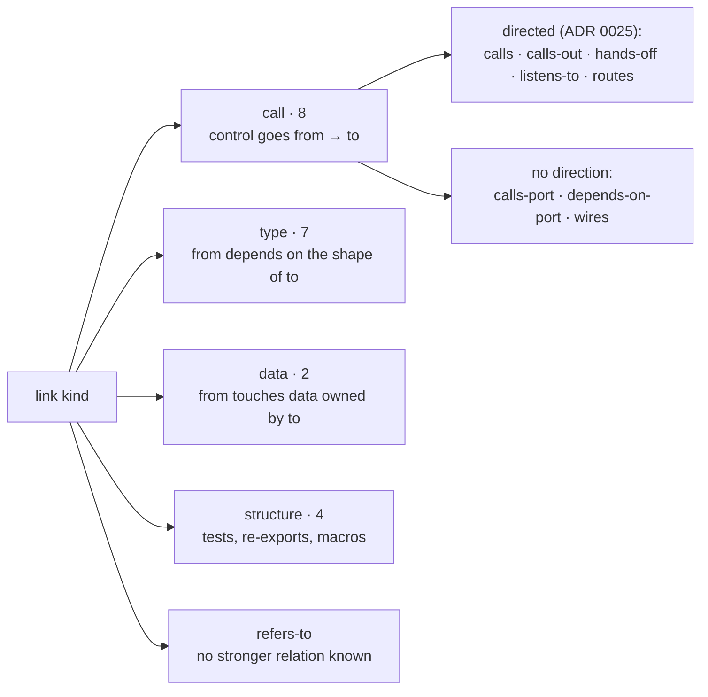

# ADR 0033 · Link kinds: 21 in four families, call · type · data · structure, plus `refers-to`; `routes` and `queues` are kinds 20 and 21; five call-family kinds carry a direction

- Date: 2026-10-04
- Status: accepted
- Source: tau-rs/arch-design#16 (arch FINDINGS F-3, tau-rs/arch#10), decided by the user on #16 and tau-rs/arch#10 (2026-10-03); completes [ADR 0025](0025-direction-call-family-grain.md) and [ADR 0031](0031-items-and-item-ids.md)

## In plain words

A link is one fact of the form "this item uses that one", and its kind says how: it calls it, implements it, holds one in a field, reads it, tests it. Every screen that draws or counts links, every lint and the golden facts in arch-fixtures read the kind, so the list of kinds has to be fixed before anything is built on it. The record named "the 21 kinds in four families + refers-to" (handoff-arch.md §2) but listed only 19, and spec §7 described two more relations as facts without naming them: a route registered to its handler, and a shared table used as a queue. tau-rs/arch shipped schema version 0 with those two as `routes` and `queues`, and the user accepted it as shipped. This ADR writes the list down: 21 kinds sorted into four families (call, type, data, structure) plus `refers-to`, the kind of a link nothing stronger is known about. One analogy: the four families are the sections of a library and the kinds are the shelves; `refers-to` is the returns cart, where a book waits when nobody knows its shelf yet. The merged smallsvc golden (976 links) already uses exactly these kinds, so neither tau-rs/arch nor arch-fixtures changes.

## Context

- tau-rs/arch main, `schemas/facts.schema.json` and `arch-facts` `model.rs`: `LinkKind` has 22 values in the order below, `LinkKind::family()` returns the family (`None` for `refers-to`), `LinkFlags.access` is `read` or `write`, `Table.queue` lists who inserts and who dequeues. `schema_version` is 0.
- handoffs/handoff-arch.md §2 names 19 kinds: resolved from the type-checked view `calls · calls port · depends on port · implements · refines · inherits · uses type · holds · reads · matches on · tests · re-exports · expands · decorates · constructs`; guessed from patterns `hands off · listens to · calls out · wires`. Spec §7 lists `route → handler` with the middleware stack and `shared table used as a queue` (who inserts, who dequeues) as facts.
- [ADR 0025](0025-direction-call-family-grain.md) decision 1 calls `calls · calls out · hands off · listens to · routes` "the call family" and exempts `wires`, `calls port` and `depends on port` from direction.
- [ADR 0031](0031-items-and-item-ids.md): a link that touches a variant or field targets the type and names the member in `Link.member`.
- arch-fixtures `golden/smallsvc/facts.json` (merged, arch-fixtures#10): 976 links in 20 of the 22 kinds; `refines` and `listens-to` do not occur. Its description calls the list a "provisional reading frozen by this file".

## Decision

The link kinds of schema version 0 are the 22 values of `LinkKind` in `tau-rs/arch@main:schemas/facts.schema.json`, spelled in kebab-case as there: 21 kinds in four families, plus `refers-to` outside them. `routes` and `queues`, the two not in handoff-arch.md §2, are kinds 20 and 21.

| family | kind | the link says | qualifier | direction | smallsvc |
|---|---|---|---|---|---|
| call | `calls` | calls a function or method | | yes | 84 |
| call | `calls-port` | calls through a port (a trait object or generic the unit owns) | | no | 17 |
| call | `depends-on-port` | takes a port as a dependency (field, parameter) without a call site | | no | 26 |
| call | `hands-off` | hands work to another task, thread or channel (spawn, send) | | yes | 1 |
| call | `listens-to` | receives from a channel, topic or signal | | yes | 0 |
| call | `calls-out` | calls out of the unit to an external | | yes | 51 |
| call | `wires` | wires an implementation to a port at composition time | | no | 5 |
| call | `routes` | a registered `route → handler`, with the middleware stack | | yes | 5 |
| type | `implements` | implements a trait | | no | 9 |
| type | `refines` | a trait has the target as a supertrait | | no | 0 |
| type | `inherits` | inherits in the derive or `Deref`-delegation sense | | no | 46 |
| type | `uses-type` | uses a type in a signature or a body | | no | 254 |
| type | `holds` | holds a value of the type in a field | `member` | no | 69 |
| type | `constructs` | constructs the type | `member` | no | 125 |
| type | `matches-on` | matches on the type's variants | `member` | no | 32 |
| data | `reads` | reads or writes state, a field, a table | `access: read \| write`, `member` | no | 158 |
| data | `queues` | uses a shared table as a queue | `access: write` inserts, `read` dequeues | no | 2 |
| structure | `tests` | tests the target | | no | 10 |
| structure | `re-exports` | re-exports the target (`pub use`) | | no | 39 |
| structure | `expands` | expands to the target (macro) | | no | 8 |
| structure | `decorates` | decorates the target (attribute macro) | | no | 14 |
| — | `refers-to` | names the target, no stronger relation known | | no | 21 |

- **Direction.** Five call-family kinds carry a direction: `calls · calls-out · hands-off · listens-to · routes`, the set ADR 0025 decision 1 named "the call family". The other three call-family kinds (`calls-port · depends-on-port · wires`) are exempt as ADR 0025 decision 1 already says. Where the spec and MAP-17 said "call-family link" for direction, they now say "directed link" and name the five.
- **Qualifiers.** `holds · constructs · matches-on · reads` name a variant or field in `Link.member` (ADR 0031). `reads` and `queues` say read or write in `flags.access`.
- **Spelling.** A kind is written as the schema writes it, kebab-case, in facts, schemas, code and checks. Earlier prose spellings (`calls out`, `uses type`, in ADR 0025, ADR 0028 and handoff-arch.md) name the same kinds.
- **Confidence is per link.** handoff-arch.md §2 says how each kind is usually found (resolved, or guessed from a pattern); every link still carries its own confidence ([ADR 0009](0009-confidence-levels.md)), and the kind does not fix it. In smallsvc, 46 `inherits` (derives) and 14 `decorates` are guessed, 47 of 51 `calls-out` are resolved. When a kind is resolved and when guessed is tau-rs/arch-design#61, not this ADR.

Why (#16, tau-rs/arch#10): the schema list already parses in tau-rs/arch, the merged golden is written in it, and it gives the two relations spec §7 already requires a kind each, so recording it costs no fixture bump.

## Consequences

- Nothing changes in tau-rs/arch: `LinkKind`, `LinkKind::family()` and the schema are the record. One thing to know there: `family() == Call` is not the direction set; whatever computes the direction smell set in `arch-views` (ADR 0025 consequences) names the five kinds.
- arch-fixtures: the direction check spells its five kinds with spaces (`"calls out"`, `"hands off"`, `"listens to"`) while the golden writes kebab-case, so it never checks a `hands-off` or `listens-to` link (tau-rs/arch-fixtures#20). smallsvc's one `hands-off` link leaves `main`, which has no column, so the golden's result does not change.
- Spec §5 and §7, MAP-17 and its check row in `spec/map-invariants.md`, and the **link** entry of `spec/vocabulary.md` point here.
- One honest consequence: "call family" now means eight kinds, of which three carry no direction, so the family alone does not tell a reader whether a link can be a direction smell; ADR 0025's title and its decision 1 still use the term for the five. The spec says "directed link" for those five so the two meanings never meet in one sentence.
- A second honest consequence: two kinds, `refines` and `listens-to`, are in the list with no link in the golden, so nothing yet checks that arch-analyze emits them correctly; the first fixture that has a supertrait or a channel receive covers them.
- A third: `refers-to` sits outside the families, so a screen that groups links by family shows it apart, and a count by family does not add up to the link count (smallsvc: 955 in families, 21 `refers-to`).
- Rejected: the 19 kinds of handoff-arch.md §2, with route → handler and table-as-queue kept off the links (`Table.queue` already names the inserters and dequeuers, but the map could not draw a route or a queue as an edge, and ADR 0025 already gives `routes` a direction); re-spelling the kinds with spaces to match the earlier prose (every fact and the golden would change).
