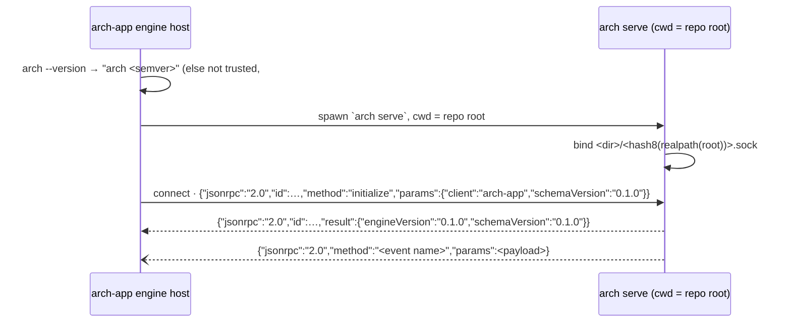

# ADR 0034 · arch-api wire contract: `schemas/arch-api.json` (OpenRPC 1.3, `x-arch-events`) pinned by commit; `arch serve` on a per-repo unix socket, one JSON-RPC message per line; `initialize` returns both versions; the schema version is semver

- Date: 2026-10-04
- Status: accepted
- Source: tau-rs/arch-design#130 (arch-app FINDINGS F-3 to F-5, sent to tau-rs/arch#7), decided by the user on #130 (2026-10-04); completes [ADR 0023](0023-settings-errors-secrets-packaging-telemetry.md) "the API schema is their contract" and amends HANDOFF §2 "published as an artifact of every release"

## In plain words

The desktop app (arch-app) starts the engine with `arch serve` and talks to it over a local socket. Its typed client is generated from the engine's API schema. arch-app shipped its side of that conversation against choices it wrote down alone: where the socket lives, how messages are framed, what the first call returns, how events are described, and where the schema file is fetched from. Nothing in arch-design had decided them, and nobody had decided how the schema version moves.

This ADR adopts arch-app's choices as they are, with two corrections: both sides hash the resolved real path of the repo, and the engine checks who owns the socket directory. The schema version is a semver string, so an app can tell an engine that only added methods from one that broke one.

One analogy: arch-app already built the plug, and this ADR writes the socket's shape down so both sides build to the same drawing.



## Context

- arch-app main:
  - `packages/arch-client/src/socket-path.ts` computes the socket path. Its comment reads "seed design, choice 5; tau-rs/arch#7".
  - `packages/arch-shell/src/node/engine-host.ts` and `engine-process.ts` are the engine host. It spawns `[binary, 'serve']` with the repo root as cwd. It first tries to attach to an existing socket and deletes a stale one, then retries connect plus `initialize` every 100 ms for 10 s.
  - `packages/arch-client/scripts/generate.mjs` reads `openrpc`, `info.version`, `components.schemas`, `methods[].params` / `.result` and `x-arch-events[]`.
  - `packages/arch-client/schema/schema.lock.json` pins `{ "repo": "tau-rs/arch", "commit": "none", "path": "schemas/arch-api.json" }`.
- arch-app `FINDINGS.md`:
  - F-3: "`arch serve` run with the repo as cwd derives its own socket path from the repo root".
  - F-4: "pins it by repo path and commit, not by release asset".
  - F-5: "OpenRPC 1.3 with an `x-arch-events` block … `info.version` as the schema version, an `initialize` method".
- handoffs/handoff-arch.md §2 says "the schema is published as an artifact of every release". §5 says "a schema change is announced in `arch-design` … and shipped as a new schema version".
- tau-rs/arch main: `arch serve` is a stub that exits 2. `schemas/` holds `facts.schema.json` and `check.schema.json`, each generated from Rust types and drift-tested, with an integer `schema_version`.
- The OpenRPC 1.3 meta-schema (`@open-rpc/meta-schema` 1.14.9) allows `^x-` keys at the top level of a document.

## Decision

### 1. The schema file

`schemas/arch-api.json` in tau-rs/arch is published by being committed at that path. Consumers pin it by repo path and commit (`tau-rs/arch@<sha>:schemas/arch-api.json`); release tags point at commits. No release asset is built.

The file is an OpenRPC 1.3 document (`"openrpc": "1.3.2"`):

| key | content |
|---|---|
| `info.title` · `info.version` | `"arch-api"` · the schema version (§4) |
| `methods[]` | one entry per method: `name`, `params[]` (`name`, `schema`, `required`), `result` |
| `components.schemas` | the named types methods and events refer to |
| `x-arch-events[]` | one entry per pushed event: `{ "name": "<event>", "payload": <JSON Schema or $ref> }` |

arch generates it from the Rust types, drift-tests it as it does the other schemas, and validates it against the OpenRPC meta-schema in CI.

### 2. The transport

| point | rule |
|---|---|
| process | `arch serve`, run with the repo root as cwd, no other argument. One engine per repo. |
| repo root | the cwd resolved to its real path (symlinks followed), trailing `/` and `\` removed. The app resolves the real path too, before hashing. |
| `hash8` | FNV-1a 32-bit over the root's UTF-16 code units (JavaScript `charCodeAt`), as 8 lowercase hex digits. Examples: `/repo` → `81f9fa62`; `/Users/me/code/orderly` → `0366f73b`; `/tmp/café` → `4eabacfd`. A root that is not valid Unicode is refused. |
| socket path, Unix | `$XDG_RUNTIME_DIR/arch/<hash8>.sock` when `XDG_RUNTIME_DIR` is set and non-empty (trailing `/` removed), on any Unix; otherwise `/tmp/arch-<uid>/<hash8>.sock`. `TMPDIR` is not used. |
| socket path, Windows | `\\.\pipe\arch-<user>-<hash8>`, deferred (§5) |
| who creates it | The engine. It creates the directory with mode `0700`, and refuses to serve when the directory exists but is owned by another user or open to others. |
| one engine | A socket that accepts a connection means an engine is already running: `arch serve` exits non-zero and says so. A socket file that refuses connections is stale: the engine removes it and binds. |
| framing | JSON-RPC 2.0, one UTF-8 message per line, terminated by `\n`. No batches. |
| errors | the JSON-RPC 2.0 codes: `-32700` parse error, `-32600` invalid request, `-32601` method not found, `-32602` invalid params. arch's own errors use `-32000` to `-32099` and are listed in the schema with the method that returns them. |
| events | JSON-RPC notifications (no `id`) whose `method` is the event name and whose `params` is the payload. The names and payloads are listed in `x-arch-events`. |

### 3. `initialize`

```json
→ {"jsonrpc":"2.0","id":"arch-host-initialize","method":"initialize","params":{"client":"arch-app","schemaVersion":"0.1.0"}}
← {"jsonrpc":"2.0","id":"arch-host-initialize","result":{"engineVersion":"0.1.0","schemaVersion":"0.1.0"}}
```

| field | meaning |
|---|---|
| `params.client` | who is calling, free text (`arch-app`, `arch-fixtures`, a test) |
| `params.schemaVersion` | the schema version the client was generated from. Optional. |
| `result.engineVersion` | the engine's semver, the same string `arch --version` prints after `arch ` |
| `result.schemaVersion` | `info.version` of the `arch-api.json` the engine was built with |

The engine always answers `initialize`, whatever version the client sends. Comparing the versions is the client's job (§4), and a mismatch is a status, not a refused connection. Other methods do not require `initialize` first: it is the readiness and version handshake.

### 4. The schema version is semver

`info.version` starts at `0.1.0`. The usual 0.x semver exception (any 0.x minor may break) does not apply: a break moves the major even at 0.

| change | bump | examples |
|---|---|---|
| addition | minor | a new method, event, optional param or result field |
| break | major | a method or event removed or renamed, a param made required, a field removed or retyped |
| wording only | patch | descriptions, examples |

Compatibility, read by the client:

| app pinned | engine | the app's reading |
|---|---|---|
| 0.1.0 | 0.1.0 | ok |
| 0.1.0 | 0.2.0 | compatible: the engine only added things |
| 0.2.0 | 0.1.0 | older engine: methods added in 0.2 answer `-32601` |
| 0.x | 1.0.0 | incompatible: status only, nothing past `initialize` is called |

Why semver and not the integer the other schemas use: with an integer bumped on every change, the app cannot tell "the engine added a method I do not call" from "a method I call broke", so it can only ever warn.

### 5. Deferred

- **Windows.** `arch serve` reports that it is unsupported on Windows until a named-pipe lane exists. The path in §2 stays the target.
- **The app method set over MCP for agents** (HANDOFF §2, "same handlers"). `arch mcp` is scoped to one session element ([ADR 0012](0012-confinement-driver-hooks.md), #117). The surface that serves the app methods to an agent is decided when the first method after `initialize` is added (tau-rs/arch#7), together with #127's CLI list.

## Consequences

- tau-rs/arch #7:
  - Slice (a): `schemas/arch-api.json` with `initialize` only and `x-arch-events: []`, at `0.1.0`.
  - Slice (b): `arch serve` binds §2 and answers `initialize`.
  - Slice (c): views, intents, sessions (the `session_*` methods of #127), Ask and settings, each announced here before it ships, as a minor version or with a major-version ADR.
- arch-app:
  - Resolves the repo root's real path before `socketPathFor`.
  - Moves `schema.lock.json` off `"none"` once slice (a) merges.
  - Reads compatibility as in §4.
- arch-fixtures: `fixtures-for-ui/<state>/responses/initialize.json` (#44) carries `schemaVersion` in this format.
- `arch-api.json` does not follow the integer `schema_version` of `facts.schema.json` and `check.schema.json`. Those are documents read whole, while this is an API whose readers need to know whether an addition is safe.
- handoffs/handoff-arch.md §2 points here instead of "an artifact of every release".
