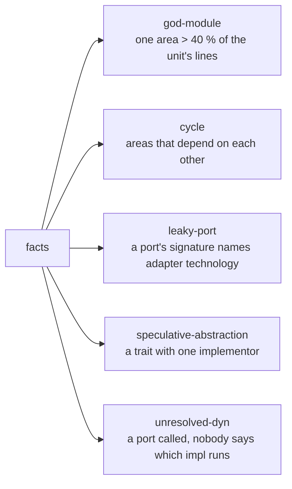

# ADR 0035 · What the five lints check: `god-module` on an area's share of lines, `cycle` between areas, `leaky-port` on a port's signature, `speculative-abstraction` on a trait's implementors, `unresolved-dyn` on a port nobody wires

- Date: 2026-10-04
- Status: accepted
- Source: tau-rs/arch-design#123, decided by the user on #123 (2026-10-04); completes [ADR 0032](0032-rules-allows-format-five-lints.md) "what each lint checks is not decided here"

## In plain words

A lint is a check arch runs on its facts by itself, without anyone writing a rule; each hit is a finding, and `.arch/rules` sets each lint to `block`, `warn` or `off`. ADR 0032 named the five lints `arch init` turns on, but nothing said what any of them checks, so tau-rs/arch could not build one. This ADR gives each lint its condition, what the finding sits on, the witness it carries, and its threshold where it has one. Each definition follows what architects and researchers already recommend, and each was counted on the smallsvc golden in arch-fixtures, a small, clean hexagonal service: it gets no finding from any of the five once the analyzer reads its test file, which is the result a clean design should get. One analogy: the lints are a building inspector's checklist, and each line says what to measure and where to point when it fails, so two inspectors never disagree on the same house. A finding on a guessed fact still only warns ([ADR 0009](0009-confidence-levels.md)).



## Context

- [ADR 0032](0032-rules-allows-format-five-lints.md): the names, `[lints]` levels, the `arch init` template at `"warn"` for all five, and an allow that names a lint as its `rule`. tau-rs/arch `arch-facts` `V1_LINTS` reads the names as opaque strings; milestone 4 checks dependency rules only (tau-rs/arch#13).
- The only rules the record printed are on `flows/superseded/ask-flow.html`: `god-module: domain 41 % (threshold 40 %) · 52 / 127`, `cycles between areas: 0 · 4 areas`, `leaky-port: 0 · 3 ports` ("no port leaks an adapter type"), `speculative-abstraction: EventSink, 1 impl · 9 months`; and on `flows/map-focus.html`: a right-to-left link in layers is a cycle candidate and the `cycle` lint fires.
- [ADR 0027](0027-arch-init-sides-rule.md): rules read non-test code only; an I/O external is one of kind rpc · http · cli · topic · sql · redis · fs · tty, never a library. tau-rs/arch `arch-views` `findings.rs`: every link from an item is a dependency of its area on the target's, except `tests` links and links from test code.
- [ADR 0025](0025-direction-call-family-grain.md) decision 5 and MAP-16: a call through a trait object is an unresolved path; the map folds them into one pill per item.
- [ADR 0033](0033-link-kinds-and-families.md): `calls-port` is a call through a trait object or generic the unit owns; `implements` and `wires` name implementors and what `main` plugs in.
- arch-fixtures `golden/smallsvc/facts.json` (schema version 1): 286 items, 976 links, 9 areas, 5 traits in `ports`, all implemented on the driven side; `tests/flows.rs` holds `FakeGateway`, `FakeCarrier`, `RecordingNotifier`, which the golden does not list (the analyzer does not read test targets yet).
- Prior art, read for this ADR: Arcan's God Component and Hub-Like Dependency (Sas, Avgeriou, Uyumaz 2022, arXiv 2203.08702); Ford, Richards et al., *Software Architecture: The Hard Parts* ch. 5 (component size in statements, against the mean); Sharma, Singh, Spinellis on architecture smells (Designite); Martin's Acyclic Dependencies Principle and "Database rows" at a boundary; NDepend "Avoid namespaces mutually dependent", Sonargraph and Structure101 feedback sets; Cockburn and Garrido de Paz on two adapters per port, the second a test one; Fowler's InterfaceImplementationPair, Seemann's Reused Abstractions Principle; MIRAI, cargo-call-stack and IntelliJ's Spring autowiring check on unresolved dispatch.

## Decision

Every lint reads non-test code only, as the dependency rules do (ADR 0027): items under a `test` cfg and test targets count for nothing, except as test adapters in `speculative-abstraction`. Every lint is `warn` in the `arch init` template (ADR 0032).

| lint | fires on | condition | witness | smallsvc |
|---|---|---|---|---|
| `god-module` | an area | the area holds more than **40 %** of the unit's lines, in a unit of **3 areas or more**; a line counts when a non-test item of the area spans it, once | the count (`368 of 1,401 lines`), recomputed on every run, and the area's paths | 0 (`domain` 26.3 %) |
| `cycle` | a set of links | two or more areas depend on each other, through any link the dependency rules count; one finding per cycle, on its **cheapest cut**: the fewest links whose removal breaks it, taking links a dependency rule forbids before links the rules allow | each link of the cut, with its `file:line`; the cycle's areas in order | 0 |
| `leaky-port` | an item of the port | a **port**'s signature names an **adapter type** | the link from the port's item to that type | 0 |
| `speculative-abstraction` | a trait | a port with one implementor and no test implementor; or a trait that is not a port with one non-test implementor | the trait's `file:line` and its implementor's | 0 (2 in the golden as it stands, below) |
| `unresolved-dyn` | a port | the unit calls a port (`calls-port`) and no `wires` link says which implementor runs, while the port has **no implementor, or two or more** outside test code; one finding per port | every `calls-port` call site, `file:line` | 0 |

The terms the table uses:

- **Port**: a trait the unit declares on the domain side and an item on the driving or driven side implements. smallsvc has 5 (`Notifier`, `OrderRepository`, `Outbox`, `PaymentGateway`, `ShippingProvider`).
- **A port's signature**: the trait and its items, as written in source (before `#[async_trait]` expands it): parameter, return and associated types, error types inside `Result`, generic arguments, bounds and supertraits.
- **Adapter type**: an item of a driving or driven area; or a type from an **adapter library**, a crate through which an I/O external is reached (its witness is the crate's `Cargo.toml` line, as `sqlx` for `postgres` in smallsvc) or a crate that, outside ports, only driving and driven areas use (`axum`, `reqwest`). A library the domain side also uses (`serde_json`, `uuid`, `chrono`, `anyhow`) is not an adapter library.
- **Test implementor**: an `impl` of the trait under a `test` cfg, or in a test target of the unit's crate (`tests/*.rs`).

```
speculative-abstraction

  trait declared in the unit
        │
  is it a port?
     yes ──► one implementor, no test implementor ─► finding   "PaymentGateway has one adapter and no test adapter"
     no  ──► one non-test implementor ─────────────► finding   "EventSink has one implementor; a test double does not count"
```

- **Allows.** An allow names the lint as its `rule` (ADR 0032). Its `site` is the item the finding sits on: the port's item for `leaky-port`, the trait for `speculative-abstraction` and `unresolved-dyn`, a cut link's site for `cycle`. A `god-module` finding sits on an area, so its `site` is written `area:<name>`, a form this ADR adds to ADR 0032's site column.
- **A cut link that also breaks a dependency rule** gives two findings, the rule's and the cycle's, and each names the other, so the fix card shows one fix for both. Each keeps its own level and its own allows: allowing the rule does not allow the cycle, nor the reverse. Why: the rule may block while the lint warns, and merging them would lose one of the two levels.
- **Confidence** ([ADR 0009](0009-confidence-levels.md)). A `cycle` finding keeps its level only when every link of its cut is `resolved`. `unresolved-dyn` reads `wires`, which is guessed, so it warns and never blocks whatever its level.
- **Dropped from the earlier page.** The age in `EventSink, 1 impl · 9 months`: no source recommends it, and it needs git history the facts do not key on ([ADR 0002](0002-keys-commit-hash-deltas.md)). The fix card may still show the trait's age.

Why (#123): each condition is the one practitioners and the research already use for that smell, narrowed so a clean hexagon, the shape `arch init` sets up, gets no finding; and each counts something the style of the code does not inflate, so a codebase of many small functions gets the same findings as one of few large ones.

## Consequences

- tau-rs/arch: implement the five lints in `arch-views` next to `check_rules`, each finding with `origin: core`, its witness and the lint name as `rule`; accept `area:<name>` as an allow site. The analyzer reads the unit crate's test targets for `implements` links, or every port whose test double sits in `tests/` looks speculative (tau-rs/arch issue, filed with this ADR).
- arch-fixtures: smallsvc expects 0 findings from each lint once the analyzer reads `tests/flows.rs`; until then the golden shows `PaymentGateway` and `ShippingProvider` as speculative (their test adapters are in `tests/flows.rs`), and nothing else.
- The **lint**, **finding** and **allow** entries of `spec/vocabulary.md` point here.
- One honest consequence: 40 % is a calibrated guess, the number the earlier page printed. Arcan sets its threshold from the other components of the same system; a fixed share is easier to explain and to allow, and a unit with 3 areas can trip it while one with 20 almost never does.
- A second honest consequence: `god-module` measures lines, not statements as *The Hard Parts* does. Lines are what the facts already hold (every item has a span); comments and blank lines inside an item count.
- A third: a module cycle inside an area is never a finding. Rust allows cycles between the modules of one crate, and a parent module and its child often use each other (smallsvc: `app` and `app::pay`); the research does not show those cycles are harmless, only common.
- A fourth: an adapter library is recognised from usage or from an I/O external's `Cargo.toml` line. A crate the domain side already uses elsewhere hides a leak of the same crate through a port; that domain use is the first thing to fix.
- A fifth: one `wires` link clears every call of its port, even a call the wired value never reaches. The facts do not say what a wired value reaches.
- A sixth: `unresolved-dyn` does not cover closures (`Box<dyn Fn>`), traits the unit does not own (`dyn Error`, `dyn Any`) or spawned work. rust-analyzer gives no edge for the first, the second have no implementor set to count, and the third is not dyn; all three stay in the map's unresolved pill (MAP-16).
- Rejected:
  - for `god-module`, a module holding more than 30 items (Designite's 30-class limit has no data behind it, and it fires on a cohesive domain module of many small types: smallsvc `domain::order`, 36 items), an area touching more than 40 % of the links (the domain core of every hexagon fires: smallsvc `domain`, 40.9 %), and items instead of lines (many small functions make an area look larger than the same code written as few);
  - for `cycle`, module or item grain, kinds limited to the five directed ones (a type used both ways is a mutual dependency too), every cycle listed separately, and one merged finding when a cut link also breaks a rule (the rule's level and the lint's would collapse into one);
  - for `leaky-port`, any third-party type (it fires on `Outbox::enqueue` taking a `serde_json::Value`, which the domain side uses anyway);
  - for `speculative-abstraction`, exempting every port (Cockburn: a port with no test adapter is the case to flag) and counting a mock for a trait inside one side (Seemann: an interface extracted for mocking is still one implementation);
  - for `unresolved-dyn`, firing on every call through a port (17 findings in smallsvc, every port call of the hexagon the template sets up), and one finding per call site (a port called from many small functions would flood the list).
